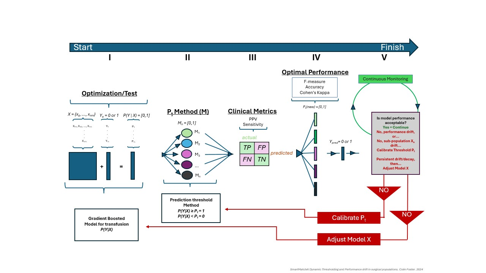

# Classifier Thresholding
Adaptive Prediction Thresholding for Classifiers in Deployment (APTCID)

**We propose a post-training probability threshold recalibration procedure for probabilistic binary or multi-label classifier algorithms in deployment: Adaptive Prediction Thresholding for Classifiers in Deployment (APTCID).  APTCID serves several purposes: it mitigates the burden of updating the model, it maintains goal-driven relevant evaluation metrics (here clinical metrics), and it provides the opportunity to automatically update prediction thresholds and monitors changes in performance.**

Schematics describing the process of threshold optimization and recalibration.  
- **Step I** Stratification variables, timestamps, prediction probabilities, and outcomes are fed into the pipeline.
- **Step II-III** Our sampling algorithm scans prediction thresholds and computes our metrics.
-   **Step IV** Calculate the maximum median scoring metric, and choose that threshold as the optimal threshold.
-   **Step V** Monitor the performance over time for decay, and if decay is detected, the process repeats from step II.

