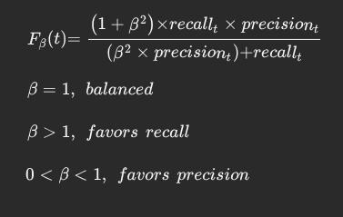
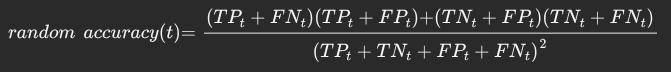
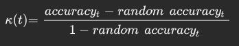
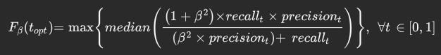

# Classifier Thresholding
Adaptive Prediction Thresholding for Classifiers in Deployment (APTCID)

**We propose a post-training probability threshold recalibration procedure for probabilistic binary or multi-label classifier algorithms in deployment: Adaptive Prediction Thresholding for Classifiers in Deployment (APTCID).  APTCID serves several purposes: it mitigates the burden of updating the model, it maintains goal-driven relevant evaluation metrics (here clinical metrics), and it provides the opportunity to automatically update prediction thresholds and monitors changes in performance.**

Schematics describing the process of threshold optimization and recalibration.  
- **Step I** Stratification variables, timestamps, prediction probabilities, and outcomes are fed into the pipeline.
- **Step II-III** Our sampling algorithm scans prediction thresholds and computes our metrics.
-   **Step IV** Calculate the maximum median scoring metric, and choose that threshold as the optimal threshold.
-   **Step V** Monitor the performance over time for decay, and if decay is detected, the process repeats from step II.

#### Review Evaluation Metrics (in context)
*Classifiers* output a probability of an outcome...

*Decision threshold* establishes the predicted outcome....
$\mathcal{T_a}, \forall{a} \in \mathbb{R} = [0,1]$

Comparison of predicted outcome to actual outcome is fundamental to model assessment and the basis for evaluation metrics.  We derive these metrics – precision (1), recall (2), accuracy (3), etc. – from the confusion matrix (Figure 1, step III).   

|   	|act  |   	|
|---	|---	|---	|
|pred | TP	| FP	|
|   	| FN	| TN	|

As it was alluded to in the introduction, there has been robust reporting in the literature pertaining to the choice of appropriate model evaluation metrics[8-11].  These works highlight common themes encountered in ML evaluation: inevitable changes in class or outcome distributions, non-constant class imbalance ratios, and the importance of goal-driven metrics. 

Our requirements for model performance are based on the real-world scenario important to clinical outcomes, i.e. goal-driven metrics. Two concerns: primary - minimize false negatives (*FN*), secondary - maintaining an acceptable level of false positives (*FP*). Thus, we chose to track model *precision* and *recall* during deployment.

$Precision(t) = \frac{TP_t}{TP_t + FP_t} \tag{1}$

$Recall(t) = \frac{TP_t}{TP_t + FN_t} \tag{2}$

While one might propose threshold optimization and recalibration that imposes tolerances to achieve professional expectations of the above metrics individually, there is an established scoring metric that combines both into a single score, the *F-measure*. The harmonic mean between sensitivity and precision bounded between zero and one.  This measure can be modified by a positive integer weighting factor, *beta*, where a weight greater than one favors sensitivity and a weight less than one favors precision[12].   When an F-measure's beta equals one, it indicates a perfect balance between these metrics.

The class imbalance perspective generally rules out the use of *accuracy* alone as a reliable metric[7-10].  Intuitively, an evaluation metric that includes the true negative (*TN*) count skews the predictive performance of a class imbalanced dataset, and this skew increases as the number of true positives decreases.

$accuracy(t) = \frac{TP_t + TN_t}{TP_t + TN_t + FP_t + FN_t}$

**GHOST**.  The Generalized tHreshOld ShifTing procedure (GHOST) is a threshold “shifting” method developed by Esposito et al to help with model selection based on optimized performance[11].  GHOST can briefly be described in four key steps: perform bootstrap stratified sampling, scan decision thresholds over some range, compute evaluation metrics for each threshold, and select the threshold for optimal performance either by minimizing or maximizing a scoring metric.  In Esposito et al’s 2021 paper, they chose Cohen's kappa as their metric to maximize.  Cohen’s kappa measures a model’s performance relative to random assignment[12]. 

Analogous to GHOST and alluded to above, **APTCID** performs a bootstrap stratified sampling...it follows that our objective function selects the threshold that maximizes the median Recall weighted *F-measure*. 

