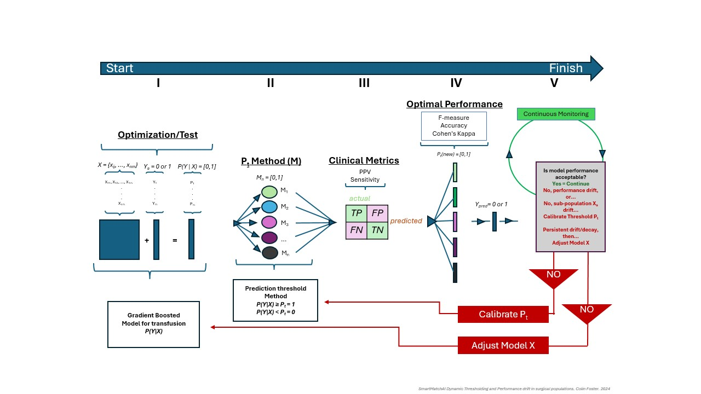
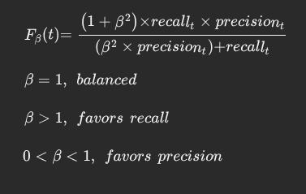
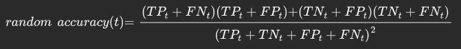
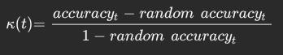
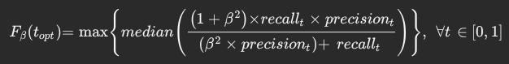
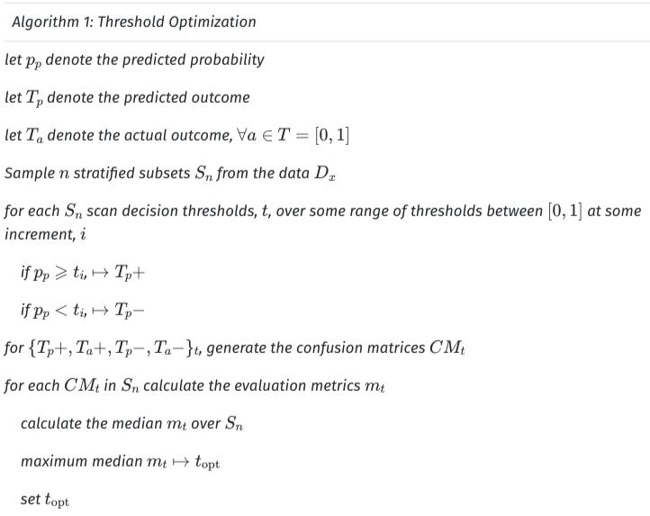
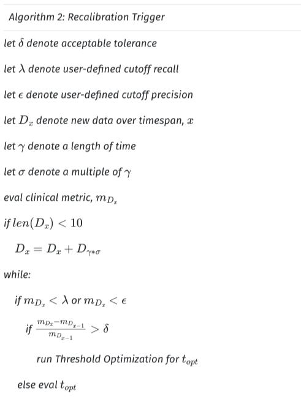

# Classifier Thresholding
Adaptive Prediction Thresholding for Classifiers in Deployment (APTCID)

**We propose a post-training probability threshold recalibration procedure for probabilistic binary or multi-label classifier algorithms in deployment: Adaptive Prediction Thresholding for Classifiers in Deployment (APTCID).  APTCID serves several purposes: it mitigates the burden of updating the model, it maintains goal-driven relevant evaluation metrics (here clinical metrics), and it provides the opportunity to automatically update prediction thresholds and monitors changes in performance.**

Schematics describing the process of threshold optimization and recalibration.  
- **Step I** Stratification variables, timestamps, prediction probabilities, and outcomes are fed into the pipeline.
- **Step II-III** Our sampling algorithm scans prediction thresholds and computes our metrics.
-   **Step IV** Calculate the maximum median scoring metric, and choose that threshold as the optimal threshold.
-   **Step V** Monitor the performance over time for decay, and if decay is detected, the process repeats from step II.

#### Review Evaluation Metrics (in context)
*Classifiers* output a probability of an outcome...

*Decision threshold* establishes the predicted outcome....
$\mathcal{T_a}, \forall{a} \in \mathbb{R} = [0,1]$

Comparison of predicted outcome to actual outcome is fundamental to model assessment and the basis for evaluation metrics.  We derive these metrics – precision (1), recall (2), accuracy (3), etc. – from the confusion matrix (Figure 1, step III).   

|   	|act  |   	|
|---	|---	|---	|
|pred | TP	| FP	|
|   	| FN	| TN	|

As it was alluded to in the introduction, there has been robust reporting in the literature pertaining to the choice of appropriate model evaluation metrics[8-11].  These works highlight common themes encountered in ML evaluation: inevitable changes in class or outcome distributions, non-constant class imbalance ratios, and the importance of goal-driven metrics. 

Our requirements for model performance are based on the real-world scenario important to clinical outcomes, i.e. goal-driven metrics. Two concerns: primary - minimize false negatives (*FN*), secondary - maintaining an acceptable level of false positives (*FP*). Thus, we chose to track model *precision* and *recall* during deployment.

$Precision(t) = \frac{TP_t}{TP_t + FP_t} \tag{1}$

$Recall(t) = \frac{TP_t}{TP_t + FN_t} \tag{2}$

While one might propose threshold optimization and recalibration that imposes tolerances to achieve professional expectations of the above metrics individually, there is an established scoring metric that combines both into a single score, the *F-measure*. The harmonic mean between sensitivity and precision bounded between zero and one.  This measure can be modified by a positive integer weighting factor, *beta*, where a weight greater than one favors sensitivity and a weight less than one favors precision[12].   When an F-measure's beta equals one, it indicates a perfect balance between these metrics.

The class imbalance perspective generally rules out the use of *accuracy* alone as a reliable metric[7-10].  Intuitively, an evaluation metric that includes the true negative (*TN*) count skews the predictive performance of a class imbalanced dataset, and this skew increases as the number of true positives decreases.

$accuracy(t) = \frac{TP_t + TN_t}{TP_t + TN_t + FP_t + FN_t}$

**GHOST**.  The Generalized tHreshOld ShifTing procedure (GHOST) is a threshold “shifting” method developed by Esposito et al to help with model selection based on optimized performance[11].  GHOST can briefly be described in four key steps: perform bootstrap stratified sampling, scan decision thresholds over some range, compute evaluation metrics for each threshold, and select the threshold for optimal performance either by minimizing or maximizing a scoring metric.  In Esposito et al’s 2021 paper, they chose Cohen's kappa as their metric to maximize.  Cohen’s kappa measures a model’s performance relative to random assignment[12]. 

Analogous to GHOST and alluded to above, **APTCID** performs a bootstrap stratified sampling...it follows that our objective function selects the threshold that maximizes the median Recall weighted *F-measure*. 

#### Method:

As proof-of-concept, we apply **APTCID** to the test set.  Test is a six-month window following the validation set.  The data is split into equal time intervals based on the datetime of the surgical cases.  This approach provides a reasonable proxy for detecting temporal performance shift, sub-population drift, and change in class IR.  Data streams are dynamic, and one would be reasoned to suspect that in a large enough system one time interval’s data may look entirely different from the next.  Our trigger algorithm accommodates this eventuality by exploiting a lookback window.  Suppose a hypothetical timespan where data is sparce – few surgeries were performed.  A lookback window does exactly what its name suggests.  To maintain performance if the model’s performance decays in a sparce interval, we automatically enlarge the case aperture using cases from a previous interval.  We look back in time to perform threshold optimization.  This choice ensures that our prediction threshold is based on sufficiently large sample sizes and tailored to the most recent case trends. 

**Pseudocode for a Generalized Threshold Optimization Procedure.**  First, we define our inputs.  The prediction probability ($p_p$), predicted outcome ($T_p$), and actual outcome ($T_a$) variables are used to generate random stratified subsets from the data.  Subsets are scanned across thresholds and clinical metrics, $CM_t$, are calculated for each threshold.  We choose the topt from the maximum median F-beta score.

Exactly when it is appropriate to recalibrate the prediction threshold should be driven by clinical professionals.  Just to reiterate, the first concern is model safety and preserving patient health and well-being.  The recalibration algorithm enables user-defined cut-off values for the model’s recall performance, and we can guide the recalibration empirically using a performance tolerance measure.  Simply put, tolerance is the tolerable percent change in performance from one interval to the next.  For this study’s proof of concept, we set this tolerance to 0.01 and restrict its use to scenarios where the difference is negative indicating a performance drop from intervalt to intervalt+1.  After the threshold has been optimized for performance, we move on to the next interval using the new threshold for prediction. 

**Recalibration Trigger Algorithm.** We define several variables.  Delta, lambda, epsilon, gamma, and sigma are user-defined acceptable performance parameters, a lookback window and its size, respectively.  For some data, Dx, we compute evaluation metrics, mx, and assess whether Dx performance is sub-optimal.  If so, we check whether the percent change in recall from Dx-1 is greater than our performance tolerance, delta. If true, we run the Threshold Optimization algorithm. 

**REFERENCES** 

1. Ashmore R, Calinescu R, Paterson C. Assuring the Machine Learning Lifecycle: Desiderata, Methods, and Challenges. ACM Comput Surv. 2022;54(5):1-39. doi:10.1145/3453444 

2. Feng J, Phillips RV, Malenica I, et al. Clinical artificial intelligence quality improvement: towards continual monitoring and updating of AI algorithms in healthcare. NPJ Digit Med. 2022;5(1):66. doi:10.1038/s41746-022-00611-y 

3. Fletcher RR, Nakeshimana A, Olubeko O. Addressing Fairness, Bias, and Appropriate Use of Artificial Intelligence and Machine Learning in Global Health. Front Artif Intell. 2021;3:561802. doi:10.3389/frai.2020.561802 

4. Abràmoff MD, Tarver ME, Loyo-Berrios N, et al. Considerations for addressing bias in artificial intelligence for health equity. npj Digit Med. 2023;6(1):170. doi:10.1038/s41746-023-00913-9 

5. Pleiss G, Raghavan M, Wu F, Kleinberg J, Weinberger KQ. On Fairness and Calibration. 

6. Johnson JA, Moore B, Hwang EK, Hickner A, Yeo H. The accuracy of race & ethnicity data in US based healthcare databases: A systematic review. The American Journal of Surgery. 2023;226(4):463-470. doi:10.1016/j.amjsurg.2023.05.011 

7. M H, M.N S. A Review on Evaluation Metrics for Data Classification Evaluations. IJDKP. 2015;5(2):01-11. doi:10.5121/ijdkp.2015.5201 

8. Sokolova M, Lapalme G. A systematic analysis of performance measures for classification tasks. Information Processing & Management. 2009;45(4):427-437. doi:10.1016/j.ipm.2009.03.002 

9. Tharwat A. Classification assessment methods. ACI. 2021;17(1):168-192. doi:10.1016/j.aci.2018.08.003 

10. Gaudreault JG, Branco P, Gama J. An Analysis of Performance Metrics for Imbalanced Classification. In: Soares C, Torgo L, eds. Discovery Science. Vol 12986. Lecture Notes in Computer Science. Springer International Publishing; 2021:67-77. doi:10.1007/978-3-030-88942-5_6 

11. Brabec J, Komárek T, Franc V, Machlica L. On Model Evaluation under Non-constant Class Imbalance. Published online April 15, 2020. doi:10.48550/arXiv.2001.05571 

12. Bishara et al. AI-Guided Surgical Blood Readiness: Overcoming Real-World Challenges in Prospective Validation for Safer, More Efficient Blood Preparation. NEJM AI. 2024 

13. Rijsbergen, C. J. Van. Information Retrieval. 2nd ed., Butterworth-Heinemann, 1979. 

14. Esposito C, Landrum GA, Schneider N, Stiefl N, Riniker S. GHOST: Adjusting the Decision Threshold to Handle Imbalanced Data in Machine Learning. J Chem Inf Model. 2021;61(6):2623-2640. doi:10.1021/acs.jcim.1c00160 

15. Pedregosa et al. Scikit-learn: Machine Learning in Python. JMLR 12, pp. 2825-2830, 2011. 
